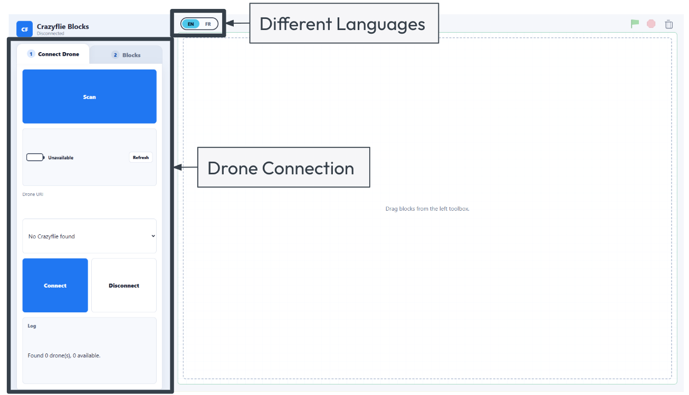
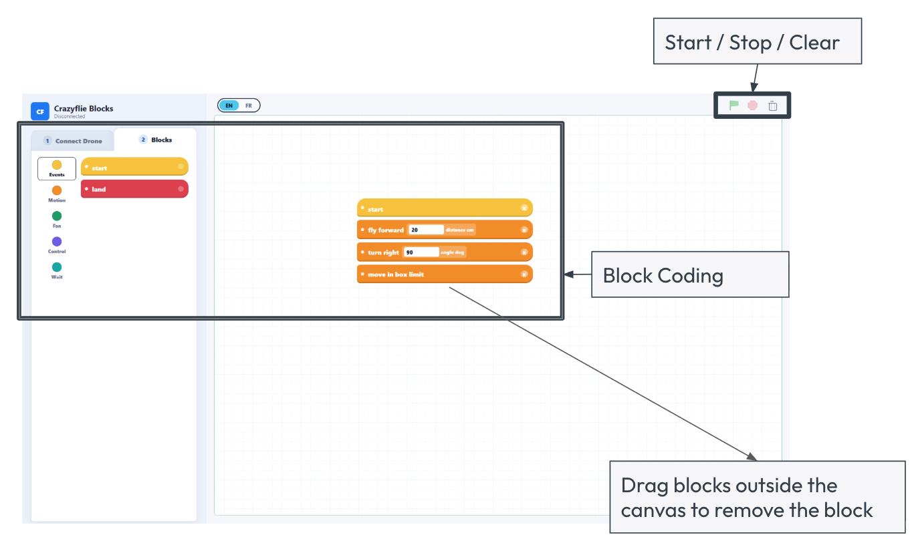

# Guide d'utilisation de Crazyflie Blocks

Ce guide explique comment démarrer le projet, connecter un drone Crazyflie et exécuter des commandes de vol simples depuis l'interface de blocs dans le navigateur.

> Note de sécurité : pour le premier test, retirez les hélices si possible, ou placez le Crazyflie sur une surface plane et dégagée, avec les mains loin des hélices. Lorsque vous appuyez sur `Connect`, le système fait brièvement tourner les moteurs pour identifier le drone.

## 1. Architecture du système


Le projet comporte trois parties principales :

- `server.py` : le backend Python local. Il démarre le serveur web et contrôle le Crazyflie avec `cflib`.
- `web/` : l'interface de blocs de type Scratch. Ouvrez `http://127.0.0.1:8765` dans un navigateur.
- Crazyradio + Crazyflie : l'ordinateur doit avoir le dongle USB Crazyradio branché, et le Crazyflie doit être allumé.

## 2. Préparation du matériel


Vérifiez les points suivants avant de commencer :

- Le dongle USB Crazyradio est branché sur l'ordinateur.
- Le Crazyflie est chargé et allumé.
- Le Crazyflie est posé sur une table ou un sol plat, avec un espace dégagé autour.
- `figure 8` et `move in box limit` nécessitent un Flow deck.
- L'ordinateur qui exécute `server.py` doit être le même ordinateur que celui où le Crazyradio est branché.

## 3. Première installation

Sur un nouvel ordinateur, installez une fois la dépendance Python :

```bash
cd Crazyflie-Demo
python3 -m pip install --user --upgrade pip
python3 -m pip install --user cflib
```

Si votre système n'autorise pas la mise à jour de pip, exécutez seulement :

```bash
python3 -m pip install --user cflib
```

Sous Windows, utilisez :

```powershell
cd Crazyflie-Demo
py -m pip install --user cflib
py server.py
```

## 4. Démarrer le contrôleur

Exécutez cette commande depuis le dossier du projet :

```bash
cd Crazyflie-Demo
python3 server.py
```

Une fois le serveur démarré, ouvrez cette URL dans un navigateur :

```text
http://127.0.0.1:8765
```

Si le terminal indique que Crazyradio ou Crazyflie est introuvable, vérifiez que le dongle est branché, que le Crazyflie est allumé et qu'aucun autre programme n'utilise le Crazyradio, par exemple Crazyflie Client, un autre script Python ou un nœud ROS.

## 5. Connecter le drone


Dans l'onglet `Connect Drone`, à gauche de la page web :

1. Appuyez sur `Scan` pour rechercher les Crazyflies à proximité.
2. Dans la liste `Drone URI`, choisissez une URI disponible, par exemple `radio://0/80/2M/E7E7E7E7E7`.
3. Appuyez sur `Connect`.
4. Attendez que l'état indique que la connexion est établie. Après une connexion réussie, le Crazyflie fait brièvement tourner ses moteurs comme signal d'identification.
5. Pour terminer la liaison, appuyez sur `Disconnect`.

Signification des états :

- `Available` : prêt à être connecté.
- `In use` : probablement connecté à un autre ordinateur ou programme.
- `Connected (you)` : connecté par ce backend web.
- `Unknown` : lorsqu'un drone est déjà connecté, le système évite de tester les autres URI ; leur disponibilité peut donc être inconnue.

## 6. Exécuter des blocs

Après la connexion :

1. Passez à l'onglet `Blocks` à gauche.
2. Faites glisser le bloc `start` dans la zone de script à droite.
3. Ajoutez les blocs d'action sous `start`.
4. Appuyez sur le bouton drapeau vert `Start` en haut à droite.
5. Appuyez sur le bouton rouge `Stop` si vous devez arrêter immédiatement.
6. Appuyez sur `Clear` pour supprimer le script courant.

Premier test recommandé :

1. `start`
2. `spin fans`, avec la durée réglée sur `1`

Lorsque le test moteur fonctionne, essayez un script de vol simple :

1. `start`
2. `take off`, avec la hauteur réglée sur `0.3`
3. `wait`, avec la durée réglée sur `1`
4. `land`

## 7. Utilisation de l'interface




### A. État de connexion et zone de marque

La zone en haut à gauche affiche l'état courant, par exemple `Disconnected`, `Connected`, `Running` ou un message d'erreur. Vérifiez cette zone en premier pendant l'utilisation pour confirmer si le drone est connecté.

### B. Onglet `Connect Drone`

C'est la zone principale de connexion du drone :

1. `Scan` : recherche les Crazyflies visibles par le Crazyradio.
2. `Drone URI` : sélectionne le drone à connecter.
3. `Connect` : connecte le drone sélectionné. Les moteurs tournent brièvement après une connexion réussie.
4. `Disconnect` : déconnecte le drone courant.
5. `Refresh` : actualise les informations de batterie après la connexion.

La séquence normale est `Scan` -> choisir `Drone URI` -> `Connect`.

### C. Onglet `Blocks`

Appuyez sur `2 Blocks` en haut de la barre latérale gauche pour ouvrir la boîte à outils des blocs. Les blocs sont regroupés par catégorie :

- `Events` : contient `start`.
- `Motion` : décollage, déplacement vers l'avant, rotations, figure en 8 et autres commandes de mouvement.
- `Fan` : test des moteurs.
- `Control` : logique de répétition.
- `Wait` : commandes d'attente.

Faites glisser les blocs depuis la boîte à outils de gauche vers la zone de script à droite pour construire un programme.

### D. Zone de script

La grande zone à droite est la zone de script. Règles :

- Le bloc du haut doit être `start`.
- Les blocs d'action doivent être attachés sous `start`.
- Un bloc `repeat` doit contenir au moins un bloc.
- Les champs numériques peuvent être cliqués et modifiés directement, par exemple la hauteur, la distance, la durée et l'angle.

### E. `Start` / `Stop` / `Clear`

Les trois boutons de contrôle sont en haut à droite :

- Drapeau vert `Start` : exécute le script courant.
- Carré rouge `Stop` : arrête l'action en cours et tente d'atterrir ou d'arrêter les moteurs.
- Corbeille grise `Clear` : efface les blocs de la zone de travail courante.

Si quelque chose semble anormal pendant le vol, appuyez d'abord sur `Stop`.

### F. Changement de langue

Les boutons de langue en haut à droite permettent de passer entre `EN` et `FR`. L'interface prend actuellement en charge l'anglais et le français.

### G. Journal et messages d'état

La zone `Log` à gauche affiche les messages de scan, de connexion, d'exécution et d'erreur. Si une action échoue, vérifiez d'abord le Log, puis le terminal qui exécute `server.py`.

## 8. Blocs courants

| Bloc | Fonction | Notes |
| --- | --- | --- |
| `spin fans` | Fait tourner les moteurs à faible poussée | Retirez les hélices pour le premier test |
| `take off` | Décolle jusqu'à une hauteur cible | La hauteur est limitée à une plage prudente |
| `fly forward` | Avance d'une distance en centimètres | Valeur par défaut : 20 cm |
| `turn right` / `turn left` | Tourne selon un angle cible | Valeur par défaut : 90 degrés |
| `move linear` | Avance, tourne, puis avance à nouveau | Utilise MotionCommander |
| `figure 8` | Effectue une trajectoire en huit | Nécessite un Flow deck |
| `move in box limit` | Vole dans une zone limitée | Nécessite un Flow deck |
| `wait` | Attend un nombre de secondes | Maximum : 10 secondes |
| `repeat` | Répète les blocs placés à l'intérieur | Doit contenir au moins un bloc |
| `land` | Atterrit et s'arrête | Recommandé à la fin des scripts de vol |

## 9. Vérification rapide de la connexion

Si la page web ne détecte pas le drone, exécutez ceci dans un terminal :

```bash
cd Crazyflie-Demo
python3 drone_check.py
```

Le script essaie ces canaux courants :

- `60`
- `80`
- `75`
- `115`
- `120`

Si vous voyez `SUCCESS! Connected on channel ...`, la connexion de base entre Crazyradio et Crazyflie fonctionne.

## 10. Dépannage

### Scan ne trouve pas le Crazyflie

- Assurez-vous que le Crazyflie est allumé.
- Débranchez puis rebranchez le dongle USB Crazyradio.
- Rapprochez le Crazyflie du Crazyradio.
- Fermez Crazyflie Client ou tout autre programme utilisant le Crazyradio.
- Redémarrez `python3 server.py`.

### Connect expire ou affiche In use

- Le Crazyflie est peut-être déjà connecté à un autre ordinateur.
- Fermez les autres programmes qui utilisent le Crazyradio.
- Débranchez puis rebranchez le Crazyradio.
- Redémarrez le Crazyflie, puis appuyez à nouveau sur `Scan`.

### Start ne fait rien

- Assurez-vous que `Connect` a réussi.
- Le bloc du haut dans la zone de script doit être `start`.
- Un bloc `repeat` doit contenir au moins un bloc.
- Vérifiez que le terminal n'affiche pas d'exception Python.

### `figure 8` ou `move in box limit` échoue

Ces blocs nécessitent un Flow deck. Si aucun Flow deck n'est installé, le backend refuse de les exécuter afin d'éviter un vol sans estimation de position.

## 11. Arrêter le système

Lorsque vous avez terminé :

1. Appuyez sur `Stop` dans la page web et confirmez que le drone est arrêté.
2. Appuyez sur `Disconnect`.
3. Éteignez le Crazyflie.
4. Revenez au terminal et appuyez sur `Ctrl+C` pour arrêter `server.py`.
