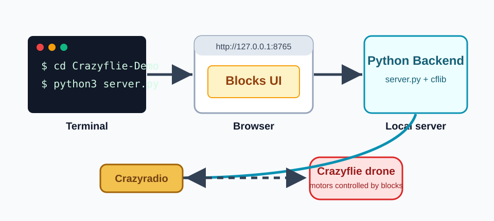
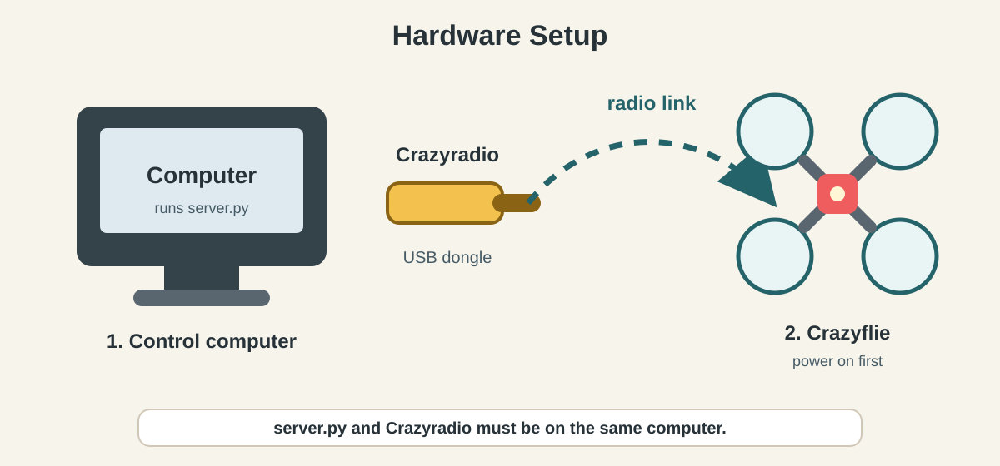
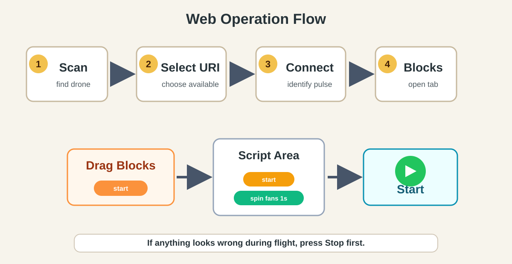
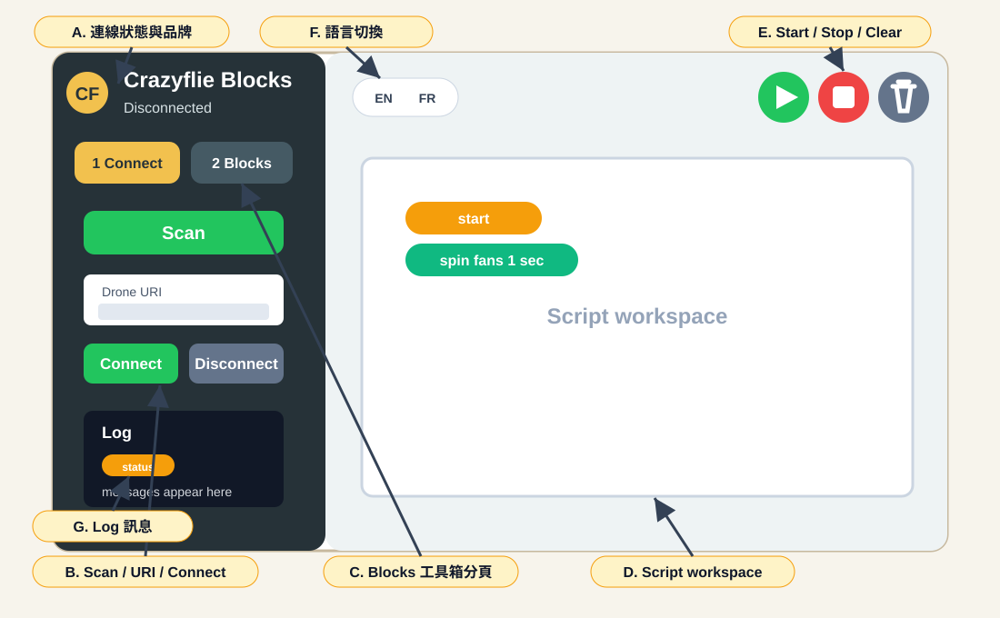

# Crazyflie Blocks 操作手冊

這份文件說明如何啟動本專案、連線 Crazyflie drone，並用瀏覽器中的 block 介面執行簡單飛行指令。

> 安全提醒：第一次測試建議拆下螺旋槳，或至少把 Crazyflie 放在平坦、空曠、手不要靠近螺旋槳的位置。按下 `Connect` 時，系統會短暫轉動馬達用來辨識 drone。

## 1. 系統架構



本專案分成三個部分：

- `server.py`：本機 Python 後端，負責啟動網頁伺服器並透過 `cflib` 控制 Crazyflie。
- `web/`：Scratch-like blocks 操作介面，瀏覽器開 `http://127.0.0.1:8765`。
- Crazyradio + Crazyflie：電腦必須插上 Crazyradio USB dongle，並且 Crazyflie 要開機。

## 2. 硬體準備



請先確認：

- 電腦已插入 Crazyradio USB dongle。
- Crazyflie 已充電並開機。
- Crazyflie 放在平坦桌面或地面上，四周清空。
- 如果要執行 `figure 8` 或 `move in box limit`，Crazyflie 需要安裝 Flow deck。
- 執行 `server.py` 的電腦，必須就是插著 Crazyradio 的那台電腦。

## 3. 第一次安裝

在新電腦第一次使用時，先安裝 Python 套件：

```bash
cd Crazyflie-Demo
python3 -m pip install --user --upgrade pip
python3 -m pip install --user cflib
```

如果你的系統不允許更新 pip，可以只執行：

```bash
python3 -m pip install --user cflib
```

Windows 可改用：

```powershell
cd Crazyflie-Demo
py -m pip install --user cflib
py server.py
```

## 4. 啟動控制介面

在專案資料夾內執行：

```bash
cd Crazyflie-Demo
python3 server.py
```

看到 server 啟動後，用瀏覽器開啟：

```text
http://127.0.0.1:8765
```

如果 terminal 顯示 Crazyradio 或 Crazyflie 找不到，請先確認 dongle 是否插好、Crazyflie 是否開機，並關掉其他可能正在使用 Crazyradio 的程式，例如 Crazyflie Client、其他 Python script 或 ROS 節點。

## 5. 連線 drone



在網頁左側的 `Connect Drone` 分頁操作：

1. 按 `Scan` 搜尋附近的 Crazyflie。
2. 在 `Drone URI` 下拉選單選擇狀態為可用的 URI，例如 `radio://0/80/2M/E7E7E7E7E7`。
3. 按 `Connect`。
4. 等待狀態顯示 connected。連線成功時，Crazyflie 會短暫轉動馬達作為 identify pulse。
5. 如果要中斷連線，按 `Disconnect`。

狀態說明：

- `Available`：可以連線。
- `In use`：可能已被另一台電腦或其他程式佔用。
- `Connected (you)`：目前這個網頁後端已連線。
- `Unknown`：已有 drone 連線時，系統會避免探測其他 URI，因此可能顯示未知。

## 6. 執行 blocks

連線成功後：

1. 切到左側 `Blocks` 分頁。
2. 把 `start` block 拖到右側 script area。
3. 把要執行的動作 block 接在 `start` 下面。
4. 按右上方綠色旗子 `Start` 執行。
5. 如需立即停止，按紅色 `Stop`。
6. 要清空目前 script，按 `Clear`。

建議第一次測試使用：

1. `start`
2. `spin fans`，duration 設為 `1`

確認馬達測試正常後，再測試飛行指令，例如：

1. `start`
2. `take off`，height 設為 `0.3`
3. `wait`，duration 設為 `1`
4. `land`

## 7. UI 操作說明



### A. 連線狀態與品牌

左上角會顯示目前狀態，例如 `Disconnected`、`Connected`、`Running` 或錯誤訊息。操作時先看這裡，確認目前是不是已連線。

### B. `Connect Drone` 分頁

這是連線 drone 的主要區域：

1. `Scan`：掃描 Crazyradio 可以找到的 Crazyflie。
2. `Drone URI`：選擇要連線的 drone。
3. `Connect`：連線選到的 drone。成功後會短暫轉動馬達辨識。
4. `Disconnect`：中斷目前連線。
5. `Refresh`：連線後可刷新電量資訊。

操作順序固定是 `Scan` -> 選 `Drone URI` -> `Connect`。

### C. `Blocks` 分頁

按左側上方的 `2 Blocks` 進入 blocks 工具箱。工具箱會依分類顯示：

- `Events`：放 `start`。
- `Motion`：起飛、前進、轉向、8 字形等動作。
- `Fan`：馬達測試。
- `Control`：重複執行。
- `Wait`：等待。

把 block 從左側拖到右側 script workspace，就可以組成執行流程。

### D. Script workspace

右側大區域是腳本工作區。執行規則：

- 最上方必須是 `start` block。
- 動作 block 要接在 `start` 下面。
- `repeat` block 裡面要放至少一個 block。
- 數字欄位可以直接點擊修改，例如高度、距離、秒數、角度。

### E. `Start` / `Stop` / `Clear`

右上角三個控制按鈕：

- 綠色旗子 `Start`：執行目前 script。
- 紅色方塊 `Stop`：停止目前動作並嘗試降落或停止馬達。
- 灰色垃圾桶 `Clear`：清空目前工作區 blocks。

飛行時若看到異常，優先按 `Stop`。

### F. 語言切換

右上角可切換 `EN` / `FR`。目前 UI 內建英文和法文，這份文件使用中文說明英文按鈕名稱。

### G. Log 與狀態訊息

左側 `Log` 會顯示掃描、連線、執行或錯誤訊息。若操作失敗，先看 Log，再看啟動 `server.py` 的 terminal。

## 8. 常用 blocks

| Block | 功能 | 注意事項 |
| --- | --- | --- |
| `spin fans` | 低推力轉動馬達 | 第一次測試建議拆螺旋槳 |
| `take off` | 起飛到指定高度 | 高度會被限制在保守範圍 |
| `fly forward` | 向前飛指定公分數 | 預設 20 cm |
| `turn right` / `turn left` | 旋轉指定角度 | 預設 90 度 |
| `move linear` | 前進、轉向、再前進 | 使用 MotionCommander |
| `figure 8` | 飛 8 字形 | 需要 Flow deck |
| `move in box limit` | 在限制範圍內飛行 | 需要 Flow deck |
| `wait` | 暫停指定秒數 | 最多 10 秒 |
| `repeat` | 重複執行內部 blocks | 內部至少要放一個 block |
| `land` | 降落並停止 | 建議飛行流程最後都放 |

## 9. 快速連線檢查

如果網頁 scan 不到 drone，可以先用 terminal 執行：

```bash
cd Crazyflie-Demo
python3 drone_check.py
```

這個 script 會依序嘗試常見 channel：

- `60`
- `80`
- `75`
- `115`
- `120`

看到 `SUCCESS! Connected on channel ...` 表示 Crazyradio 和 Crazyflie 基本連線正常。

## 10. 常見問題

### Scan 找不到 Crazyflie

- 確認 Crazyflie 已開機。
- 拔插 Crazyradio USB dongle。
- 把 Crazyflie 靠近 Crazyradio。
- 關掉 Crazyflie Client 或其他正在使用 Crazyradio 的程式。
- 重新啟動 `python3 server.py`。

### Connect timeout 或顯示 In use

- Crazyflie 可能已被另一台電腦連線。
- 關掉其他使用 Crazyradio 的程式。
- 重新插拔 Crazyradio。
- 重開 Crazyflie 電源後再按 `Scan`。

### 按 Start 沒反應

- 確認已經成功 `Connect`。
- script area 最上方必須放 `start` block。
- `repeat` 裡面至少要放一個 block。
- 確認 terminal 沒有顯示 Python exception。

### `figure 8` 或 `move in box limit` 失敗

這兩個 block 需要 Flow deck。如果沒有安裝 Flow deck，後端會拒絕執行，避免沒有位置估測時飛行失控。

## 11. 關閉系統

完成操作後：

1. 在網頁按 `Stop`，確認 drone 停止。
2. 按 `Disconnect`。
3. 關掉 Crazyflie 電源。
4. 回到 terminal 按 `Ctrl+C` 停止 `server.py`。
